<h1 align="center">基于Spring Boot 的企业信息管理系统【带论文】</h1>

- <b>完整代码获取地址：从戎源码网 ([https://armycodes.com/](https://armycodes.com/))</b>
- <b>技术探讨、资料分享，请加QQ群：692619798</b>
- <b>作者微信：19941326836  QQ：3645296857</b>
- <b>承接计算机毕业设计、Java毕业设计、Python毕业设计、深度学习、机器学习</b>
- <b>选题+开题报告+任务书+程序定制+安装调试+论文+答辩ppt 一条龙服务</b>
- <b>所有选题地址 ([https://github.com/Descartes007/allProject](https://github.com/Descartes007/allProject)) </b>

## 一、项目介绍

### 基于 Spring Boot 的企业信息管理系统，系统角色主要包含“系统管理员（后台用户）”和“普通员工”，主要功能如下：
### 系统管理员：
- 基本操作：登录、修改密码、获取/修改个人信息、会话管理（查看在线/登出）。
- 用户管理：筛选用户、查看/新增/修改/删除后台用户、重置密码、获取用户列表/分页。
- 权限与菜单：配置菜单、角色权限、按钮级权限控制（前端显示控制）。
- 公告管理：发布公告、查看公告详情、修改、删除、图片上传。
- 通用工具：调用通用下拉、关注、审核等接口
### 普通员工：
- 基本操作：登录、修改个人信息、修改密码、查看会话信息。
### 员工信息管理：查看/编辑本人信息（管理员可管理所有员工），上传头像、重置密码（管理员）。
- 通讯录：查看通讯录、联系人详情。
### 请假流程：提交请假申请、查看请假状态；管理员/审核人员可审批（审核记录）。
- 会议管理：查看会议、会议详情、个人会议记录。
- 企业/个人计划：查看/新增/修改/删除企业计划与个人计划。
- 考勤与外出：提交外出登记、查看打卡/外出记录。
- 前端交互：通过下拉字典、富文本（公告详情）、图片预览、导出/导入功能使用系统功能。

## 二、项目技术

- 编程语言：Java（后端）
- 项目架构：B/S 架构
- 前端技术：Vue 2、vue-router、Element UI、axios（统一请求实例、带 Token）、vue-quill-editor（富文本）
- 后端技术：Spring Boot 2.x、Spring Web、MyBatis / MyBatis‑Plus、Maven 构建、、Java 8

## 三、运行环境

- JDK版本：1.8及以上都可以
- 操作系统：Windows7/10、MacOS
- 开发工具：IDEA、Ecplise、MyEclipse都可以

## 四、数据库配置文件

- npm版本：6.14.13及以上都可以
- Redis版本：3.2.100及以上都可以
- 文件名：application.yml
- 编码类型：utf8

## 论文截图

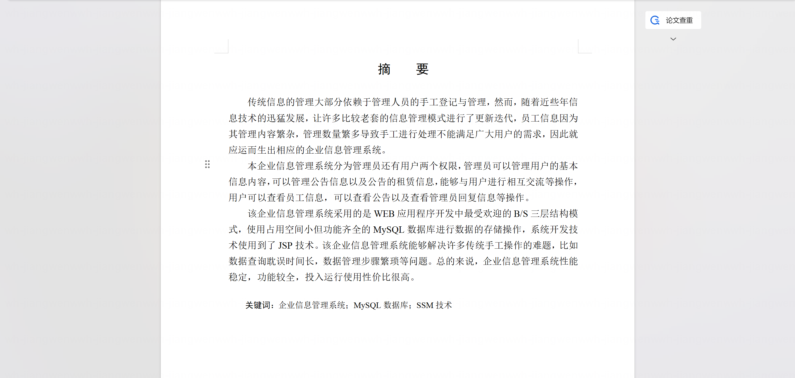

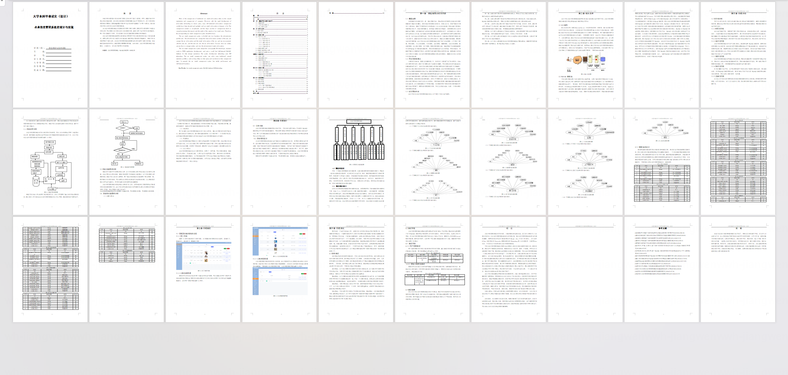

## 系统截图

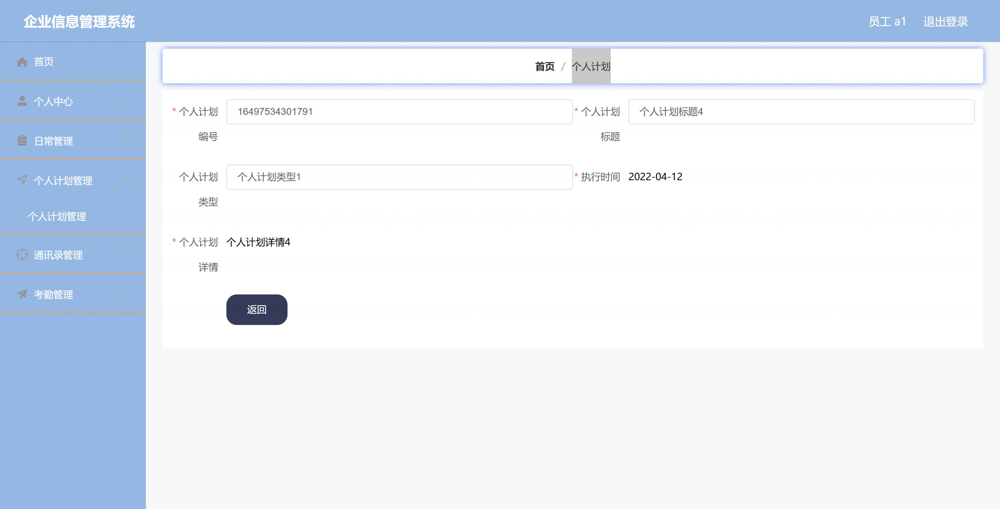

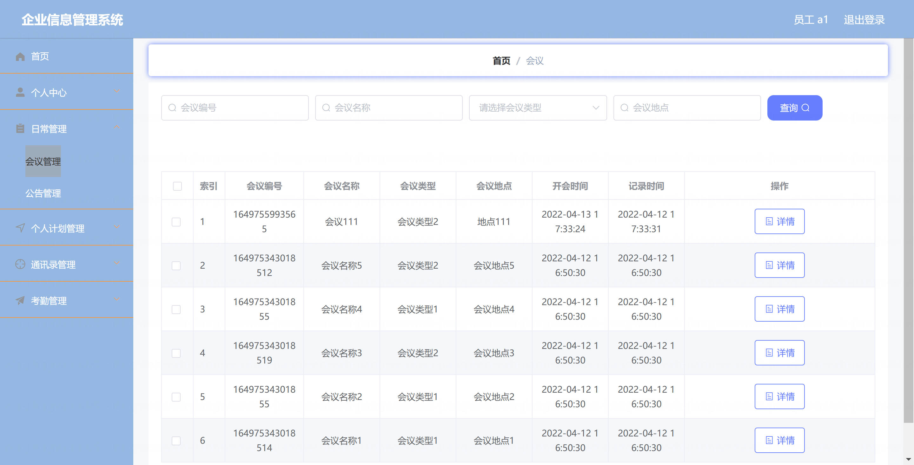

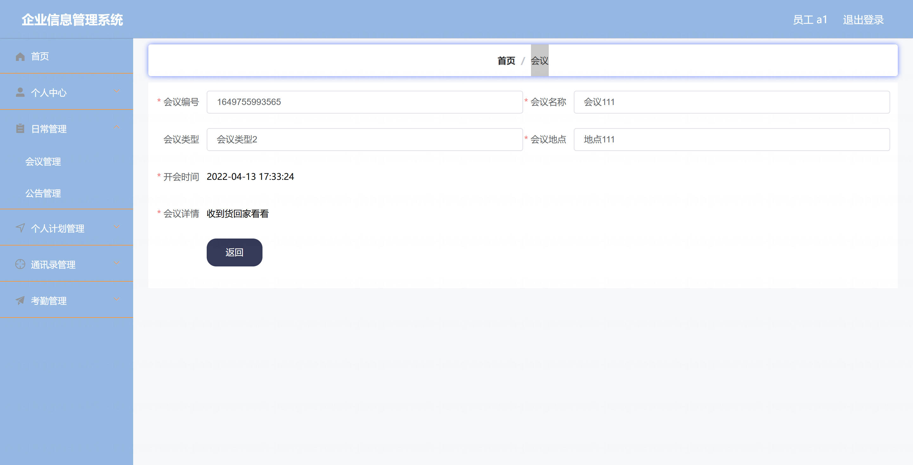

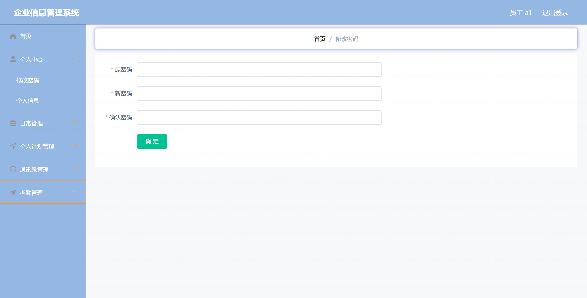

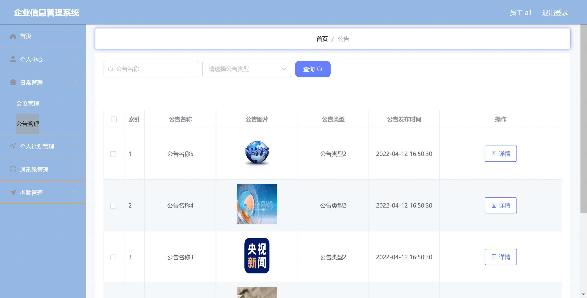

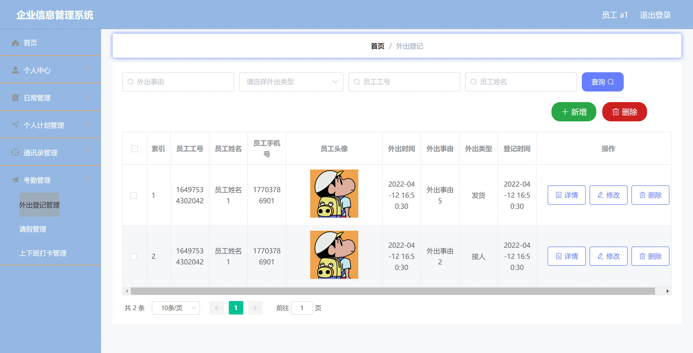

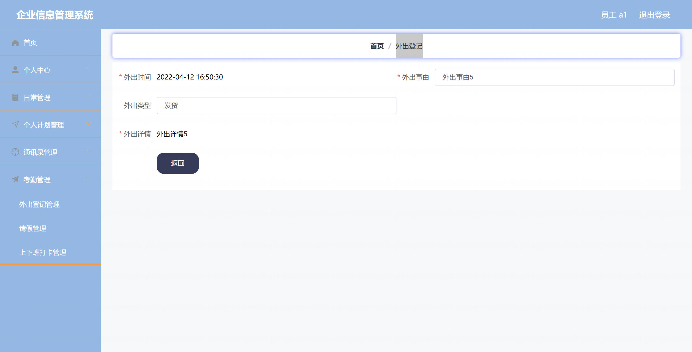

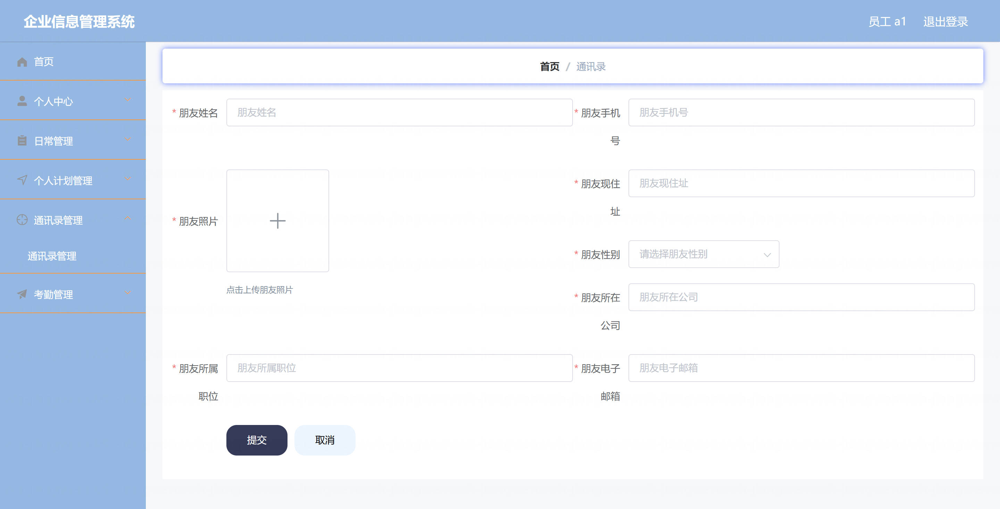

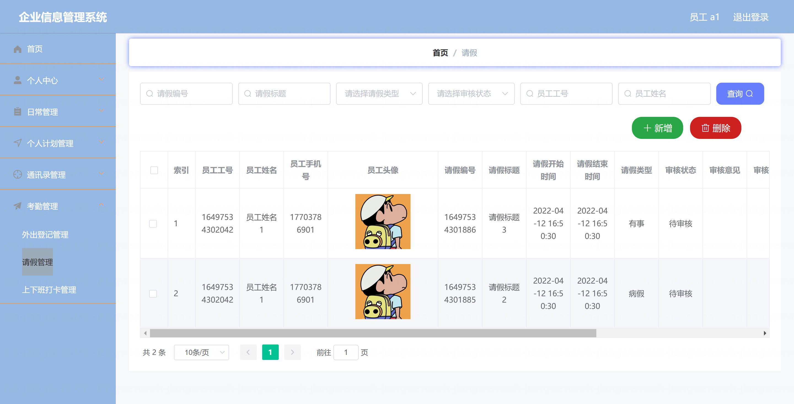